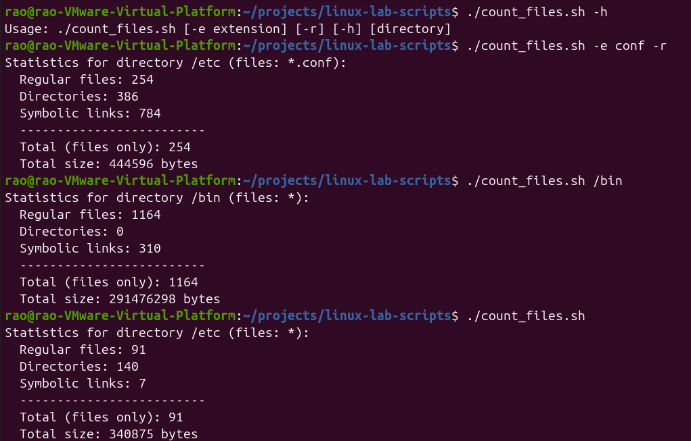

# Linux Lab Scripts

Bash scripts for the labs of the course "System Programming and OS Administration".

## Contents

- `count_files.sh` - counts regular files, directories and links in a directory (default: /etc)

## Usage

```bash
./count_files.sh                  # files in /etc
./count_files.sh /usr/share       # another directory
./count_files.sh -e conf          # only .conf files
./count_files.sh -r /etc          # with all subdirectories
./count_files.sh -h               # help
./count_files.sh -r -e conf /etc  # all .conf files with subdirectories
```

## Example



## Author

Student of group PI-241
